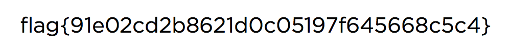

# Network Security Lab

## Introduction

- In this lab, I will be using wireshark, a networking analysis & monitor tool.

- **The goal**: Complete the `capture the flag` challenges to find hiddem strings (e.g. passwords) using wireshark

## Easy.pcap

#### Goal: Find a set of login credentials

1. Open the `easy(1).pcap` file using wireshark

2. Use `cmd + f` to use the `Find By` setting in wireshark

   - I began searching for strings initially, like login, user, and eventually I tried `password`

   - I got a match for this string in a Telnet packet with Telnet Data containing the string `password`.

3. Follow the TCP Stream

- I found the results:

```
bt login: ccssaaww
Password: welcome to 1969
```

## Medium1.pcapng

1. Find the RSA key and save it as file

- **Our approach**: Since, the rsa keys may only have the following extensions:

  - .pem
  - .p12
  - .pfx
  - .key

- I went to search for each of the following extensions and got a match for the `.key`

- I saw that I had a private key for one of the responses, so I saw followed `TCP Stream`

- When I did this, I saw the RSA key and saved it as a file

2. Next steps I did was to go the wireshark preferences and set the RSA key to the download RSA key file.

3. Filter out to HTTP streams. I went ahead through every HTTP stream and searched for `INS{`

   - In the file, `tcp.stream eq 85`, I found the Flag:

   ```
   FLAG: INS{OkThatWasWay2Easy}
   ```

## Medium2.pcap

- For this capture the flag, I followed the hint posted on Canvas of this [article](https://unit42.paloaltonetworks.com/using-wireshark-exporting-objects-from-a-pcap/#post-132864-_wea2h27o5hoo)

  - I began looking for different types of traffic such as HTTP and ftp-data

- While inspecting the `ftp-data`, I saw a `flag.png` in the `packet 426`.

- Once I found this packet, I knew I was very close and I did the following steps to convert the raw binary data to a zip file.

1. Follow TCP Stream

2. Show Data as `raw`

3. Save as `flag.zip`

4. Open the `flag.zip` file

5. I found the following image afterwards



```
flag{91e02cd2b8621d0c05197f645668c5c4}
```
